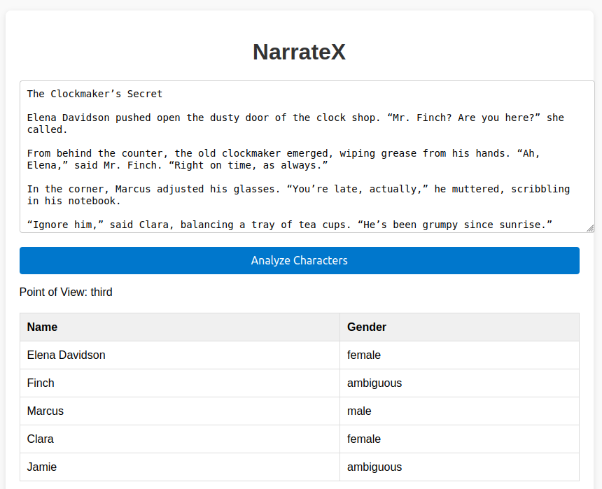
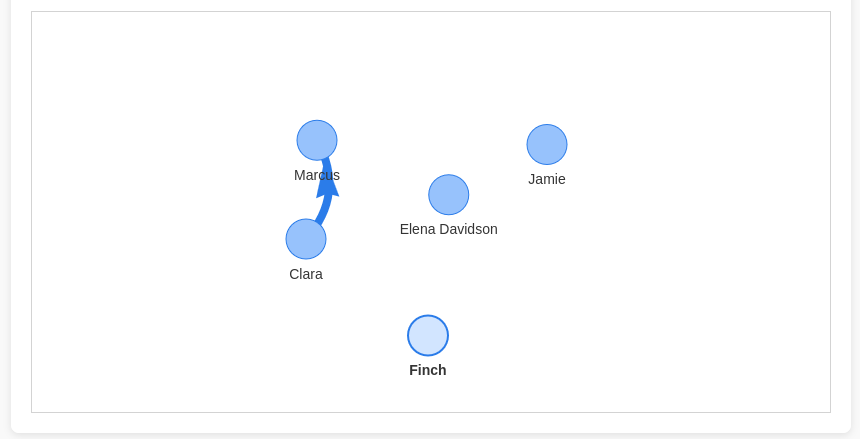

# NarrateX

NarrateX is a lightweight tool for **analyzing narrative text**. It extracts characters, predicts their gender, detects the point of view (POV), and builds a **character interaction graph** — all through a simple web interface.

---

## ✨ Features

- **Character extraction**: Automatically identifies named characters in any text.
- **Gender detection**: Uses [gender-guesser](https://pypi.org/project/gender-guesser/) to classify characters as male, female, or unknown.
  - Optionally supports LLM inference (commented by default for performance reasons).
- **POV detection**: Uses spaCy to check whether the story is written in first, second, or third person.
- **Character network graph**: Visualizes character interactions in real time using `vis-network`.
- **Frontend text samples**: Quickly test the tool without typing your own story.
- **Lightweight stack**: Pure HTML/CSS/JS frontend with a FastAPI backend — no complex frameworks required.

---

## 🛠 Installation

### 1. Clone the repository
```bash
git clone https://github.com/<your-username>/NarrateX.git
cd NarrateX
```
### 2. Install backend dependencies
```
pip install -r requirements.txt
```
#### Also download a spaCy model
```
python -m spacy download en_core_web_sm
```

### 3. 🚀 Running the App
```
cd backend
uvicorn api:app --reload
```

This will start the fastAPI server on: `http://127.0.0.1:8000`

## Open the frontend

Simply open frontend/index.html in your browser.
No server required for the frontend since it’s just static HTML/JS/CSS.

## 🧩 Usage

* Paste a story into the text area (or click a sample story).
* Click "Analyze Characters".
* View:
    - A table of characters and their detected genders.
    - The POV of the story.
    - A character network graph showing which characters appear in the same sentences.

## ⚡ Optional LLM Support

By default, only `gender-guesser` is used (fast and local).
If you uncomment the LLM code inside `gender_detector.py`, ambiguous cases (like “Mr. Finch”) can be resolved using a small local or cloud LLM.

>> Warning: Running LLMs locally may require significant memory (≥6GB). Tiny models (like TinyLlama) work best, but are still slower than gender-guesser.

## 🖼 UI images




## 🌟 Why is this interesting?

The character interaction graph gives an instant visual insight into story structure — perfect for authors analyzing multi-POV novels or screenplays.

Can be extended to:
* Use LLMs to summarize character arcs or relationships.
* Detect protagonists vs. minor characters based on graph centrality.